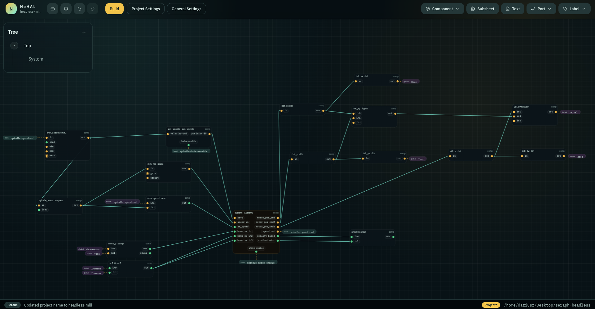

<p align="center">
  
</p>

<h1 align="center">NoHAL</h1>

<p align="center">Visual editor for LinuxCNC machine configuration.</p>

NoHAL is an editor for LinuxCNC machine configuration. It stores a project as a sheet-based graph and exports build outputs (HAL files and an INI file).



## What You Can Do Today

- Build and edit HAL connectivity as a graph (components, pins, connections, labels, ports)
- Split larger designs into subsheets (sheet definitions + placed sheet instances)
- Configure scheduling (`HAL Threads`, per-sheet thread outputs, `addf Queue`) and export ordered `addf`
- Import an existing machine configuration (INI + selected HAL files) into a project
- Export build output:
  - `<project>.hal` (main)
  - optional `<project>-postgui.hal` (postgui nets/setp)
  - optional `<project>-shutdown.hal` (shutdown snippet)
  - an INI file
- Maintain a project component library:
  - built-in LinuxCNC catalogs per version (2.7–2.10)
  - import `.comp` files or add a directory source
  - define project/global custom components (not backed by `.comp`)
- Configure and sync System-sheet projections:
  - `motmod`-managed system nodes (`motion`/`axis`/`joint`/`spindle`)
  - Mesa / HostMot2 configuration (Ethernet `hm2_eth`) with a generated System-sheet projection

## Current Scope

This repository currently ships:

- an Electron desktop app (`apps/desktop`)
- a core library (`packages/core`)
- a VitePress user manual (`docs/`)

The LinuxCNC configuration surface area is larger than what NoHAL models today. Some areas are partial or intentionally limited (for example, Mesa support currently targets Ethernet HostMot2; the component library is not exhaustive).

## Development

Requires Node.js 22 and pnpm.

```bash
pnpm install
pnpm dev
```

## Lint and tests

```bash
pnpm lint
pnpm test
pnpm typecheck
```

## Packaging

Desktop packaging is configured with `electron-builder`.

```bash
pnpm dist:linux
```

This produces Linux `AppImage` and `deb` artifacts for the desktop app.

## Docs

- Manual source lives in [`docs/`](./docs/).

```bash
pnpm docs:dev
pnpm docs:build
pnpm docs:preview
```
